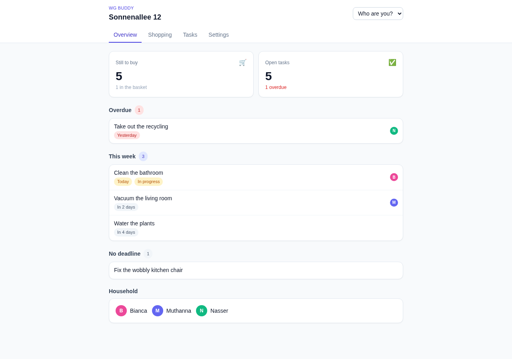
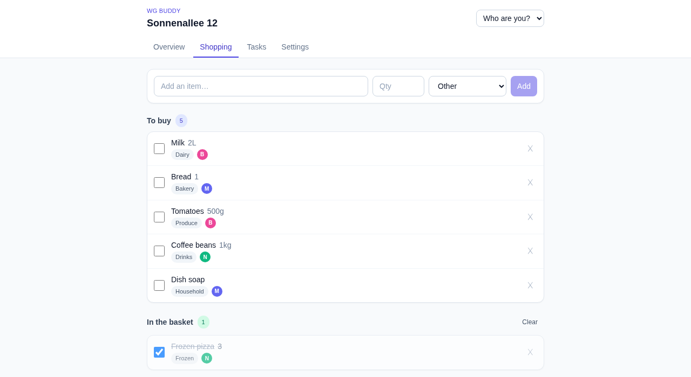
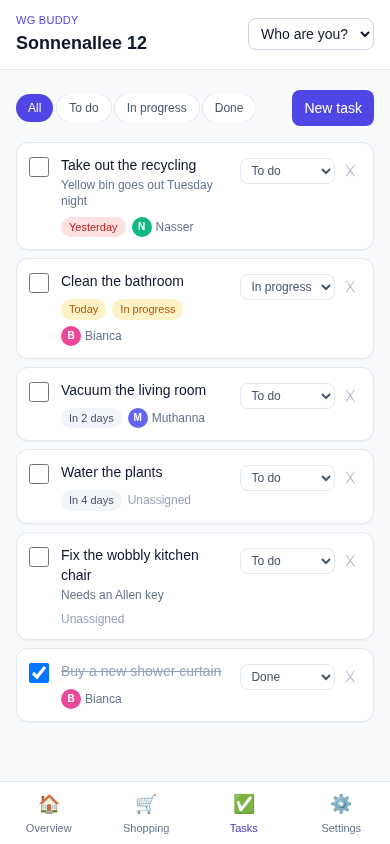

# WG Buddy

A shared household app for flatmates, couples and families. One place for the shopping list and the chores, instead of a hundred WhatsApp messages.



## What it does

- **Shared shopping list** - add items with a quantity and category, tick them off, clear the basket
- **Household tasks** - assign chores to a person, give them a deadline and a status
- **Weekly overview** - what's still to buy, what's overdue, what's due in the next seven days
- **Settings** - rename the household, add, rename, recolour or remove the people in it
- **Profile photos** - pick a photo per person; the browser crops and shrinks it before saving
- **Mobile first** - tab bar on desktop, bottom navigation on phones

|              Shared shopping list               |               Tasks on a phone                |
| :---------------------------------------------: | :-------------------------------------------: |
|   |  |

## Tech

| Layer    | Choice                                   |
| -------- | ---------------------------------------- |
| Frontend | React 18, TypeScript, Vite, Tailwind CSS |
| Backend  | Node.js, Express, TypeScript             |
| Database | PostgreSQL with Prisma ORM               |
| Dev      | Docker Compose, npm workspaces           |

## Running it

You need [Node.js](https://nodejs.org) 20+ and [Docker](https://docs.docker.com/get-docker/).

```bash
git clone <this-repo>
cd wg-buddy
cp apps/api/.env.example apps/api/.env
npm run setup     # installs deps, starts Postgres, creates tables, adds demo data
npm run dev       # starts the API and the frontend together
```

Then open **http://localhost:5173**.

| Command             | What it does                                     |
| ------------------- | ------------------------------------------------ |
| `npm run dev`       | Runs the API (port 3000) and web app (port 5173) |
| `npm run db:up`     | Starts the Postgres container                    |
| `npm run db:seed`   | Resets the database to the demo household        |
| `npm run db:studio` | Opens a visual database browser                  |
| `npm run typecheck` | Type-checks both apps                            |

## API

All routes are prefixed with `/api`.

| Method   | Route                               | Purpose                        |
| -------- | ----------------------------------- | ------------------------------ |
| `GET`    | `/health`                           | Is the server up               |
| `GET`    | `/households`                       | List households                |
| `POST`   | `/households`                       | Create a household + members   |
| `GET`    | `/households/:id`                   | One household with members     |
| `PATCH`  | `/households/:id`                   | Rename a household             |
| `DELETE` | `/households/:id`                   | Delete a household             |
| `POST`   | `/households/:id/members`           | Add a member                   |
| `PATCH`  | `/households/:id/members/:memberId` | Rename / recolour a member     |
| `DELETE` | `/households/:id/members/:memberId` | Remove a member                |
| `GET`    | `/households/:id/overview`          | Weekly summary                 |
| `GET`    | `/households/:id/items`             | Shopping list (`?done=`)       |
| `POST`   | `/households/:id/items`             | Add an item                    |
| `PATCH`  | `/items/:id`                        | Edit or tick off an item       |
| `DELETE` | `/items/:id`                        | Delete an item                 |
| `DELETE` | `/households/:id/items/completed`   | Clear the basket               |
| `GET`    | `/households/:id/tasks`             | Tasks (`?status=&assigneeId=`) |
| `POST`   | `/households/:id/tasks`             | Create a task                  |
| `PATCH`  | `/tasks/:id`                        | Edit a task                    |
| `DELETE` | `/tasks/:id`                        | Delete a task                  |

Errors always come back as JSON:

```jsonc
{ "error": "Validation failed",
  "details": [{ "field": "name", "message": "Name is required" }] }
```

## Data model

```
Household ─┬─< Member ──┬─< ShoppingItem (addedBy)
           │            └─< Task (assignee)
           ├─< ShoppingItem
           └─< Task
```

Deleting a household deletes its members, items and tasks. Deleting a *member* keeps their items and tasks, they simply become unassigned.

## Roadmap

- [ ] User accounts and household invitations
- [ ] Recurring tasks
- [ ] Shared expense splitting
- [ ] Notifications
- [ ] Dark mode
- [ ] German and English

## Notes

There is no login yet. You pick who you are from a dropdown, stored in `localStorage`. That was deliberate: it keeps the shared-data and relationship work visible without authentication getting in the way first.

See [docs/ARCHITECTURE.md](docs/ARCHITECTURE.md) for the design decisions and a walkthrough of how a request flows through the stack.
